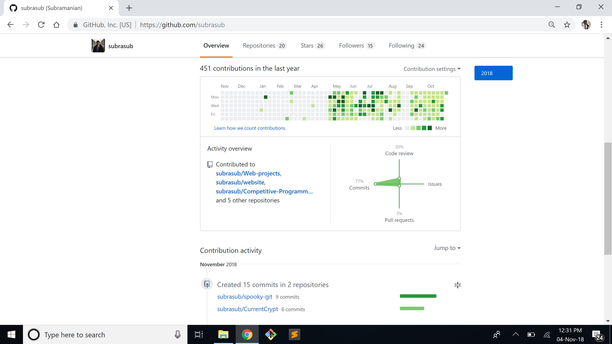
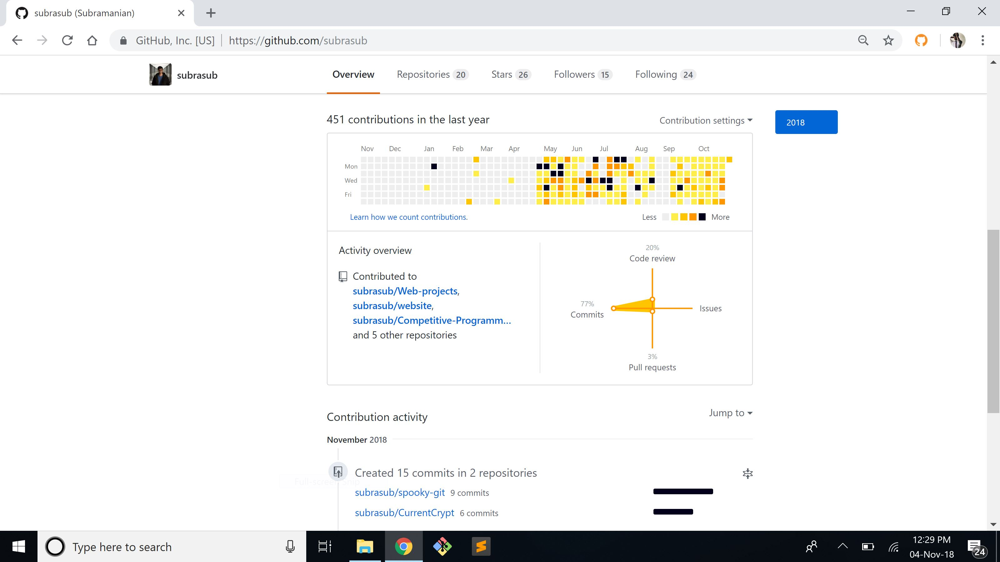

# spooky-git

A chrome extension to bring back the spooky-szn themed git-contributions! :ghost:

### Before and After spooky-git
| Before        | After           |
| ------------- |:---------------:|
| | |

## Installation
 * Clone/dowload a zip file of this repository
 * Head over to `chrome://extensions`
 * Click on `Load Unpacked` and select the path to the directory named `spooky-git`
